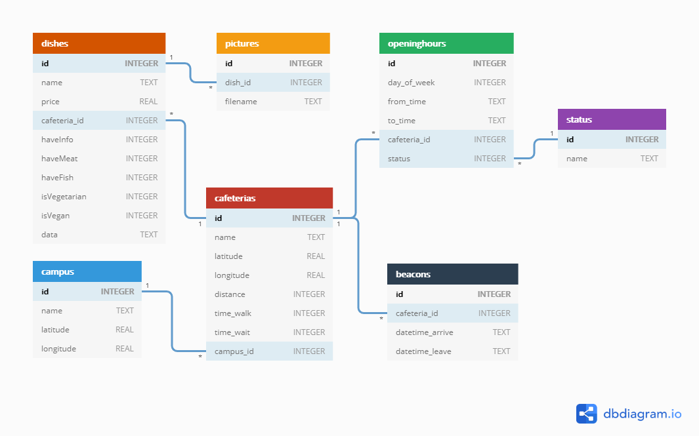

# FoodIST: Finding food on campus


Android application project for Mobile and Ubiquitous Computing class @ Instituto Superior Técnico, Lisbon, Portugal.

Meant to be used with the [FoodIST REST Server](https://github.com/geckoflume/FoodIST-Server), it provides ability to locate cafeterias, crowdsource cafeteria menus, dishes pictures and queue wait times.

More information: [https://fenix.tecnico.ulisboa.pt/disciplinas/CMov4/2019-2020/2-semestre](https://fenix.tecnico.ulisboa.pt/disciplinas/CMov4/2019-2020/2-semestre)

*Group 23*

## Features

- List of all dining options (cafeterias, canteens and bars) of IST
- Filter cafeterias by campus
- Campus autoselection based on device location
- Cafeteria details: name, opening hours, map, estimated walk time and itinerary
- Ability to add dishes and fetching menus from the server
- User status selection and cafeterias/opening times displayed accordingly
- Dark theme compatible

## TODO

- Beacons detection
- Caching
- Support pre-Lollipop devices (https://android.jlelse.eu/android-vector-drawables-on-pre-lollipop-crash-solution-45c0c34f0160)

## Specifications

This application is built around the MVVM (Model View View-Model) design pattern, using Room, a DAO with LiveData and ViewModels.

Static cafeteria data and opening times are stored in a SQLite database, populated from JSON arrays [1](app/src/main/assets/cafeterias.json) and [2](app/src/main/assets/opening_hours.json) (see [Generate opening_hours.json](#generate-opening_hoursjson)).

The architecture is build around the [Jetpack components collection](https://developer.android.com/jetpack) in Java, to introduce best Android practices (such as AndroidX, DataBinding, LiveData, Fragments...) and the layouts are designed with the help of [Google's Material Design components](https://material.io/develop/android/).

The multi-threading are managed by `java.util.concurrent` Executors, to support future Android versions (see [Android AsyncTask API deprecating in Android 11](https://stackoverflow.com/q/58767733/9875498)).

### Local database specification



## Prerequisites

- Android API Level >=v16
- Android Build Tools >=v29

## How to build

This project use the Gradle build system.
In order to benefit from Google Maps services (itineraries, times), please set your key in [debug/res/values/google_maps_api.xml](app/src/debug/res/values/google_maps_api.xml) or in [release/res/values/google_maps_api.xml](app/src/release/res/values/google_maps_api.xml) by replacing the `google_maps_key` string:
```xml
<string name="google_maps_key" templateMergeStrategy="preserve" translatable="false">YOUR_KEY_HERE</string>
```
To build it, use the `gradlew build` command or use "Import Project" in Android Studio. 

### Generate opening_hours.json

By default, the opening times are the following:
| Status         | Days            | Times         |
|----------------|-----------------|---------------|
| Student        | MONDAY - FRIDAY | 11:30 - 15:00 |
| Professor      | MONDAY - FRIDAY | 11:30 - 18:00 |
| Researcher     | MONDAY - FRIDAY | 11:30 - 18:00 |
| Staff          | MONDAY - FRIDAY | 00:00 - 23:59 |
| General Public | MONDAY - FRIDAY | 12:00 - 14:00 |

To quickly generate a new JSON file containing different data, you can use the [generate_openingtimes.sh](generate_openingtimes.sh) script, which provides a basic yet useful assistant to help you do that painful task.
Syntax :
```shell script
./generate_openingtimes.sh
```
> Note: this script requires [jq](https://stedolan.github.io/jq/) to run.

## Valuable resources:

- Coordinates type in SQLite:
	- https://stackoverflow.com/a/46732273
	- https://sqlite.org/datatype3.html
	- https://stackoverflow.com/a/12504340
	- https://abrignoni.blogspot.com/2018/08/android-nike-run-app-geolocation-sqlite.html

- SQLite:
	- https://stackoverflow.com/q/2493331
	- https://github.com/android/architecture-components-samples/blob/master/PersistenceContentProviderSample/app/src/main/java/com/example/android/contentprovidersample/data/SampleDatabase.java
	- https://codelabs.developers.google.com/codelabs/android-room-with-a-view

- Cards:
	- https://www.androidhive.info/2016/05/android-working-with-card-view-and-recycler-view/
	- https://medium.com/@droidbyme/android-cardview-with-recyclerview-90cfeda6a4d4

- Map directions, zooming:
	- https://stackoverflow.com/a/14828739
	- https://medium.com/@haydar_ai/better-way-to-get-the-item-position-in-androids-recyclerview-820667d435d4
	- https://github.com/Vysh01/android-maps-directions

- How to store dates (for opening hours):
	- https://codeblog.jonskeet.uk/2017/04/23/all-about-java-util-date/
	- https://medium.com/androiddevelopers/room-time-2b4cf9672b98
	- https://stackoverflow.com/a/38922755
	- https://docs.oracle.com/javase/8/docs/api/java/time/package-summary.html
    - https://medium.com/androiddevelopers/room-time-2b4cf9672b98

- HTTP multipart/form-data without Java libs:
    - https://stackoverflow.com/a/34409142